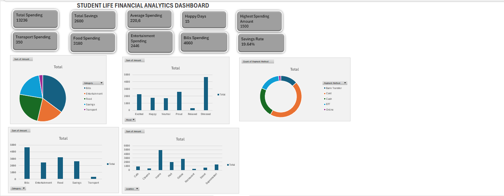

**Student Life Financial Analytics Dashboard**

**Project Overview**

The Student Life Financial Analytics Dashboard is an Excel-based data analysis project that explores student spending and saving behaviour. The project demonstrates data cleaning, analysis, visualization and dashboard design using Microsoft Excel.

The dashboard provides insights into spending patterns, savings performance, payment methods, locations and financial behaviour through KPI cards, Pivot Tables, and interactive charts.

**Project Objectives**

\- Analyze student spending habits.

\- Track savings performance.

\- Identify major spending categories.

\- Visualize financial trends using charts.

\- Build a professional dashboard using Excel.

**Tools \& Techniques Used**

\- Microsoft Excel

\- Data Cleaning

\- Pivot Tables

\- Pivot Charts

\- KPI Cards

\- Dashboard Design

\- Financial Analysis

**Project Structure**

Raw\_Data

Contains the original student financial transaction dataset.

Clean\_Data\_View

A cleaned and formatted version of the dataset prepared for analysis.

Calculations

Contains KPI calculations and financial metrics used throughout the dashboard.

Pivot\_Analysis

Contains Pivot Tables used to summarize and analyze the data.

Dashboard

Interactive dashboard displaying KPIs and visual insights.

Insights\_Report

Summary of findings and business insights derived from the analysis.

**Key Performance Indicators (KPIs)**

KPI and Values

Total Spending = R13,236 

Total Savings = R2,600 

Average Spending = R220.60 

Savings Rate = 19.64% 

**Dashboard Features**

\- KPI Performance Cards

\- Spending by Category Analysis

\- Mood-Based Spending Analysis

\- Spending by Location Analysis

\- Payment Method Distribution

\- Financial Behaviour Insights

**Key Insights**

\- Total spending amounted to R13,236 during the analysis period.

\- Total savings reached R2,600.

\- The average spending per transaction was R220.60.

\- The savings rate was 19.64%, indicating consistent saving behaviour.

\- Spending patterns varied across categories and locations.

\- Dashboard visualizations provide an easy-to-understand overview of financial behaviour.

**Dashbord Preview**

**Skills Demonstrated**

\- Data Cleaning

\- Data Analysis

\- Excel Formulas

\- KPI Development

\- Pivot Tables

\- Data Visualization

\- Dashboard Design

\- Business Intelligence Reporting

**Author**

Nomagugu Faith Ncube

Aspiring Data Analyst | IT Graduate | Passionate about Data Analytics and Business Intelligence

